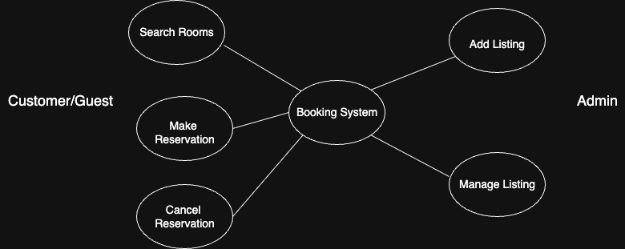

# 📘 Requirement Analysis in Software Development

This project sharpens skills essential for managing and delivering robust software systems by focusing on the cornerstone of successful development: **Requirement Analysis**.

---

## 📌 Introduction

This repository provides a structured breakdown of the Requirement Analysis phase in the Software Development Lifecycle (SDLC), using a **Hotel Booking Management System** as the case study.

🎯 **Goals**:
- Identify and document both functional and non-functional requirements.
- Explore core activities like requirement gathering, elicitation, and validation.
- Support teams in building clear, user-focused systems.

---

## 📘 What is Requirement Analysis?

Requirement Analysis is the process of gathering, interpreting, and documenting what a system needs to do from both a technical and user perspective. It ensures a shared understanding between business and technical stakeholders.

**Why it matters**:
- ✅ Brings Clarity: Ensures stakeholder expectations are captured precisely.
- 🧭 Defines Scope: Helps manage boundaries and reduce scope creep.
- 💡 Informs Design: Provides the blueprint for the architecture.
- 📊 Enables Estimation: Supports accurate planning.
- 🛠️ Improves Quality: Increases the likelihood of meeting user needs.

---

## ❗ Why is Requirement Analysis Important?

1. 🎯 **Clarity for All**
   - Prevents misunderstandings by defining exact expectations.

2. 📦 **Scope Control**
   - Helps avoid feature creep and budget overruns.

3. 🏗️ **Guides Design and Development**
   - Sets a foundation for every phase in SDLC.

---

## 🛠️ Key Activities in Requirement Analysis

| Activity | Description |
|---------|-------------|
| 📥 **Requirement Gathering** | Conduct interviews, surveys, and observe user behavior. |
| ✍️ **Elicitation** | Use brainstorming, storyboarding, and prototyping to extract deeper needs. |
| 📚 **Documentation** | Convert needs into use cases, user stories, and specifications. |
| 📊 **Modeling** | Create diagrams like DFDs, ERDs, and use case diagrams. |
| ✅ **Validation** | Review with stakeholders and define acceptance criteria. |

---

## 🧩 Types of Requirements

### ⚙️ Functional Requirements
What the system **does**.

**Examples**:
- 🔍 Search for properties by date and location.
- 👤 User login and profile management.
- 📅 Book and cancel reservations.
- 📨 Email confirmation after booking.

### 🛡️ Non-Functional Requirements
How the system **performs**.

**Examples**:
- 🚀 Pages load in under 2 seconds.
- 🔐 Passwords are encrypted; protection from SQL injection.
- 📈 Handles 1000+ users concurrently.
- 📱 Mobile responsive and accessible UI.

---

## 🧾 Use Case Diagram

Use Case Diagrams visually represent how users interact with a system. They help align understanding early.

**Actors**:
- 👥 Guest
- 👤 Registered User
- 👨‍💼 Admin

**Use Cases**:
- Search Property
- View Listings
- Register/Login
- Book/Cancel
- Receive Confirmation
- Manage Listings

📎 **View Use Case Diagram**:  
## 🧾 Use Case Diagram



---

## ✅ Acceptance Criteria

Acceptance Criteria define the “done” condition for features and prevent ambiguity.

### Example: **Checkout Feature**

- 🗓️ User selects available check-in/check-out dates.
- 💳 Provides valid payment details.
- 🔒 Payment is securely processed.
- 📄 Confirmation is shown on screen with booking summary.
- 📬 Email is sent within 2 minutes.
- 📅 Dates become unavailable to others after booking.
- ❌ If payment fails, booking is not confirmed and dates remain available.

---

## 📂 Repository Structure

```bash
requirement-analysis/
├── README.md            # Project documentation
├── alx-booking-uc.png   # (Optional) Use Case Diagram Image
